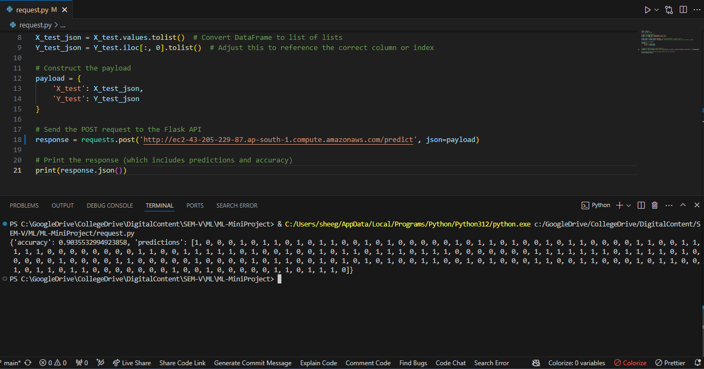

# Credit Card Fraud Detection

This project involves building a machine learning model to detect credit card fraud using a logistic regression model. The process includes data preprocessing, splitting the data into training and testing sets, training the model, and deploying it using a Flask application for predictions.

## Table of Contents

- [Project Overview](#project-overview)
- [Data Preprocessing](#data-preprocessing)
- [Splitting the Dataset](#splitting-the-dataset)
- [Model Training](#model-training)
- [Flask API Setup](#flask-api-setup)
- [Making Predictions](#making-predictions)
- [Accessing the Model](#accessing-the-model)
- [Hosted Application](#hosted-application)

## Project Overview

This project focuses on detecting fraudulent credit card transactions. The dataset used is highly imbalanced, with only a small fraction of transactions being fraudulent. To address this, a balanced dataset was created by sampling an equal number of legitimate transactions.

## Data Preprocessing

1. **Loading the Dataset**:
    - The dataset is loaded using Pandas, and basic information about the data is printed, including the first and last few records, data types, and missing values.

    ```python
    credit_card_data = pd.read_csv('DataSet/creditcard.csv')
    ```

2. **Understanding the Dataset**:
    - The dataset is inspected to understand the distribution of fraudulent (`Class = 1`) and legitimate (`Class = 0`) transactions.

    ```python
    print(credit_card_data['Class'].value_counts())
    ```

3. **Balancing the Dataset**:
    - The dataset is highly imbalanced, so a balanced dataset is created by sampling legitimate transactions to match the number of fraudulent transactions.

    ```python
    legit_sample = legit.sample(n=492)
    new_dataset = pd.concat([legit_sample, fraud], axis=0)
    new_dataset.to_csv('DataSet/new_dataset.csv', index=False)
    ```

## Splitting the Dataset

1. **Splitting the Data**:
    - The balanced dataset is split into features (`X`) and target labels (`Y`), and then further split into training and testing sets.

    ```python
    X_train, X_test, Y_train, Y_test = train_test_split(X, Y, test_size=0.2, stratify=Y, random_state=2)
    ```

2. **Saving the Splits**:
    - The training and testing sets are saved as CSV files for later use in model training and testing.

    ```python
    X_train.to_csv('TrainDataSet/X_train.csv', index=False)
    ```

## Model Training

1. **Training the Logistic Regression Model**:
    - The logistic regression model is trained on the training dataset.

    ```python
    model = LogisticRegression()
    model.fit(X_train, Y_train)
    ```

2. **Evaluating the Model**:
    - The model's accuracy on the training data is evaluated.

    ```python
    training_data_accuracy = accuracy_score(X_train_prediction, Y_train)
    ```

3. **Saving the Model**:
    - The trained model is saved using `joblib` for later use in the Flask API.

    ```python
    joblib.dump(model, 'Model/logistic_regression_model.pkl')
    ```

## Flask API Setup

1. **Setting Up the Flask Application**:
    - A Flask application is created to serve the trained model. Endpoints are provided for downloading the test dataset and making predictions.

    ```python
    app = Flask(__name__)
    ```

2. **Endpoints**:
    - `/download_test_data`: Provides instructions to download test datasets.
    - `/download_x_test` and `/download_y_test`: Download the `X_test` and `Y_test` datasets.
    - `/predict`: Accepts test data, makes predictions using the saved model, and returns the results.

## Making Predictions

1. **Making a Prediction Request**:
    - A script (`request.py`) is provided to make POST requests to the Flask API with test data. The script loads the test data, sends it to the API, and prints the model's predictions and accuracy.

    ```python
    response = requests.post('http://127.0.0.1:5000/predict', json=payload)
    print(response.json())
    ```

## Accessing the Model

1. **Starting the Flask Application**:
    - Run the Flask application to start serving the model:

    ```bash
    python app.py
    ```

2. **Using the API**:
    - Use the provided endpoints to download the test data and make predictions.

## Hosted Application

The Flask application has been hosted on an AWS EC2 machine. You can access the application using the following URL:

[http://ec2-43-205-229-87.ap-south-1.compute.amazonaws.com/](http://ec2-43-205-229-87.ap-south-1.compute.amazonaws.com/)

### Accessing the Predict Endpoint

To access the `/predict` endpoint, you can use the provided `request.py` script or any HTTP client like Postman. Below is an example of the output when making a prediction request:


